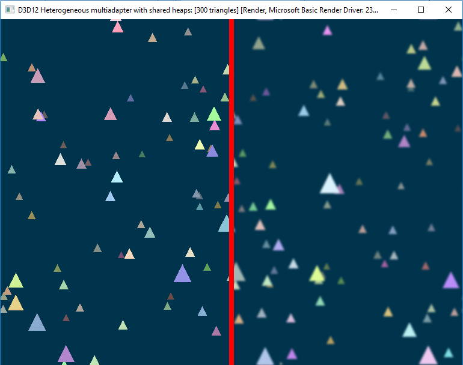

# Direct3D 12 heterogeneous multiadapter sample

This sample demonstrates how to share workloads among multiple heterogeneous GPUs using shared heaps. In this sample, a large number of triangles are rendered to an intermediate render target on one GPU, then a second GPU performs a blur, and presents it to the screen.

## Requirements
This sample is designed to run on a system with more than one GPU. This sample particularly targets hybrid laptops with a high performance discrete GPU and a lower performance integrated GPU.

For demonstration purposes, this sample will also run on a system with a single GPU and will use the software WARP adapter as the second GPU. You will need to install the **Graphics tools** feature to make the DirectX 12 WARP rasterizer available. This can be done either by pressing ALT+F5 in Visual Studio (which launches the Graphics Debugger, and automatically installs the feature if it is not available), or by navigating to the **Manage optional features** page in the Windows **Settings** app, and manually adding it from there. It should be noted, however, that the sample puts the primary workload on the adapter that is not connected to the display&mdash;which happens to be the WARP adapter&mdash;so it will actually run slower in this configuration than if there was no secondary adapter used at all.

### Optional Features
This sample has been updated to build against the Windows 10 Anniversary Update SDK. In this SDK a new revision of Root Signatures is available for Direct3D 12 apps to use. Root Signature 1.1 allows for apps to declare when descriptors in a descriptor heap won't change or the data descriptors point to won't change.  This allows the option for drivers to make optimizations that might be possible knowing that something (like a descriptor or the memory it points to) is static for some period of time.
